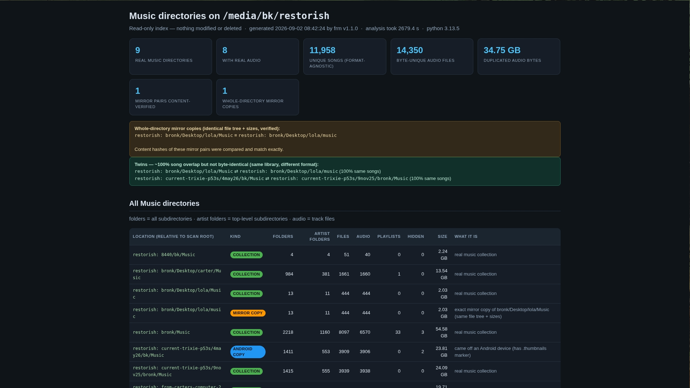

# brenda

**Find redundant music, compare drives, dig playlists.** Read-only triage for
the boxes where music actually lives.


If you are like me you keep piling backup upon backup to an external drive and you end up with a bunch of redundancy. After restoring my system (see DORiS) I wanted my music back and there was quite a mess on my dump drive. brenda came out of that: find all that music (and it only looks in music directories) and do something with it.


brenda is three tools in one keyboard-friendly command:

| command | what it does |
|---|---|
| `brenda scan [DRIVE]` | finds every `Music` directory on a drive, classifies it
(collection vs android copy vs wine boilerplate vs cache…), hashes the audio
(persistent hash cache — unchanged files are never re-hashed, so a re-scan
of a mostly-intact drive is fast),
finds byte-identical duplicates, detects whole-directory mirror copies, and
matches the *same songs* across collections even when the format differs
(FLAC vs MP3). Writes a pretty HTML report (+ Markdown + JSON) and opens it. |
| `brenda compare [RUN]` | diffs a scan run against your local music: what's
**already there** byte-for-byte, what exists as a **variant** (different
format/encode), and what's **new to you** — import candidates. |
| `brenda dig` | builds genre + BPM filtered playlists from the latest scan
**and your local music** (dedup prefers local copies — byte-identical drive
tracks point at your local file, so the playlist survives the drive being
unplugged; a same-song twin in a better format, e.g. drive FLAC vs local MP3,
wins its slot). BPM is cached by content hash, so file moves never invalidate
it, and v1.1's planned import buttons close the loop: import a new track
locally, re-dig, and its playlist path flips from the drive to home. |




The scanner inside brenda is **frm** (Find Redundant Music), and brenda
answers to that name too: everything `frm` did before still works —
`frm --open`, `frm --list-drives`, `frm /media/... --no-dedup`, the lot.

```sh
brenda drives                 # what's plugged in?
brenda scan --open            # scan the (only) external drive, open report
brenda compare                # vs your home music: exact / variant / new
brenda compare --local /media/you/bigdrive   # ...vs the big collection drive
brenda dig --bpm-min 85 --bpm-max 90 --max 100
brenda dig --local /media/you/bigdrive --genres soul --bpm-min 155 --bpm-max 160
```

## Install

```sh
git clone https://github.com/rabmach/brenda.git
cd brenda
./install.sh            # core: scan + compare. stdlib-only python3, no sudo
./install.sh --extras   # also apt-installs dig's deps (mutagen, aubio, ffmpeg)
```

User-level only: symlinks `~/bin/brenda` + `~/bin/frm`, creates the data
home, migrates any existing `~/frm/runs` and `~/groovin/bpm_cache.tsv`
(path-keyed → md5-keyed; your old BPM results survive). Idempotent — re-run
any time.

```sh
./uninstall.sh          # remove symlinks (restores any frm backup)
./uninstall.sh --purge  # also delete the data home
```

## Data home

Everything brenda produces lives in one place
(`XDG_DATA_HOME` or `~/.local/share`)/`brenda/`:

```
runs/<time>-<drive>/   report.{html,md,json} + hashes.tsv + file lists
                       (+ compare.{html,md,json} after a compare)
latest -> newest run   # what 'compare' and 'dig' read by default
index/local.json       # local-music MD5 index (compare's cache)
hashcache.tsv          # drive-file MD5 cache (size+mtime keyed) — re-scans
                       # only hash new/changed files
playlists/             # .m3u files from dig
bpm_cache.tsv          # md5-keyed BPM cache
```

## The read-only rule

Scans and compares **never write to the drive being scanned** — only
directory entries are read, and audio files *inside Music directories* are
opened (for hashing). Nothing is deleted, moved, or renamed by scan, compare
or dig. Files land only in brenda's own data home.

## The frm name

`~/bin/frm` points at the same dispatcher; invoked as `frm` it behaves
byte-for-byte like the original standalone tool. Existing scripts, aliases
and desktop buttons that call `frm` keep working untouched.

## george

If you run
[george](https://github.com/rabmach/george) (keyboard-first urwid
dashboard), these buttons slot right in:

```toml
{ label = "frm scan",   cmd = "frm --open",        term = true },
{ label = "frm drives", cmd = "frm --list-drives", term = true },
{ label = "compare",    cmd = "brenda compare",    term = true },
{ label = "dig",        cmd = "brenda dig",        term = true },
```

`term = true` keeps the scan chatter readable while `--open` pops the report
in your browser.

## Requirements

- python 3.8+ (standard library only for scan + compare — that is also what
  makes brenda portable: clone + python, no packages, no exes)
- `dig` additionally needs `python3-mutagen` (always) and `python3-aubio` +
  `ffmpeg` (only to compute BPM for tracks not already in the cache — a
  fully-cached dig runs without them). `install.sh --extras` handles Debian;
  other distros' commands are printed on request.
- Any DE or WM — brenda is a terminal tool; the only "GUI" is opening the
  report in your browser

## Other systems

brenda is written OS-neutral (pure python stdlib); the OS-specific bits
(drive detection, open-folder, notifications, data home) adapt at runtime.

- **Linux** — everything, natively. Any mounted filesystem (ext4, NTFS via
  ntfs3/ntfs-3g, FAT, exFAT…) scans fine.
- **Windows** — `install.cmd`/`install.ps1`: needs `python` on PATH, runs the
  self-test, writes a `brenda.cmd` shim. NTFS/FAT/exFAT drives work natively:
  plug in, `brenda.cmd scan` (auto-detects), or leave `brenda.cmd serve` open —
  the dropdown shows drives as they appear. **Dual-booter special**: an ext4
  drive plugged into Windows is invisible to drive letters, but brenda sees
  the disk and says so — and with WSL2 installed, `brenda.cmd wslmount`
  (elevated) mounts it read-write into the distro, clones/refreshes brenda
  there, scans it, and opens the report in the Windows browser. Without WSL2
  it prints the one-time `wsl --install --no-launch` setup line.
- **macOS** — clone and run `python3 brenda …`; drives appear from /Volumes
  (APFS/HFS+/FAT/exFAT; NTFS read-only natively). Data home: `~/Library/
  Application Support/brenda`. Notifications via osascript.
- Actions (merge/import/quarantine/delete) behave identically on all three —
  so do the safety guards: nothing is deleted without verification.

## The dual-booter moment — ext4 on Windows

There exists a rare and noble creature: a Linux person who boots into
Windows for Garmin updates or one stubborn `.exe` and — while there —
randomly decides that *today* is the day to clean up the music on an
ext4-formatted backup drive. Windows looks at that drive and sees nothing.
Old instincts say "reboot to Linux." Brenda says: don't bother.

**One-time setup** (elevated prompt where noted):

1. Windows 10/11 with **WSL2**: `wsl --install --no-launch`, reboot, then a
   distro (`wsl --install -d Debian`). If the Store refuses you — it
   refuses LTSC and unactivated boxes with error 0x80072ee7; been there —
   install the modern WSL msi from `github.com/microsoft/WSL/releases`
   instead, and fetch files from a host-side `python3 -m http.server` at
   `http://10.0.2.2:8000/` if the guest's DNS misbehaves.
2. brenda on the Windows side: clone the repo, `install.cmd`, done. (python
   from python.org — tick *Add python.exe to PATH*.)

**The moment:**

1. Plug the ext4 drive in. Windows shows nothing — that is correct; Windows
   cannot read it.
2. `brenda.cmd scan` — brenda lists the disk by model and says what it is:
   *ext4 — Windows cannot read it; run: brenda.cmd wslmount*
3. **Elevated** cmd, in the brenda folder: `brenda.cmd wslmount`. brenda
   attaches the disk to WSL2 (`--bare`), blkid-verifies the ext4 partition
   and mounts it at `/mnt/ext4`, starts `brenda serve` from your
   Windows-side clone, reads the dashboard URL out of `serve.state.json`,
   and opens it in your Windows browser.
4. Do the work on the dashboard: **copy new to local**, **merge**,
   **quarantine** — every action still goes plan → confirm → apply → undo,
   and purge still refuses to delete anything without a verified surviving
   copy. Your music never met a blind `rm`.
5. When done: `wsl --unmount \\.\PHYSICALDRIVE<n>` (brenda prints the exact
   line). The drive returns to Linux; nothing on it was touched without
   your say-so.

Notes: while mounted, the drive has one owner (WSL) — Windows Explorer
cannot see it mid-session, by design. `wslmount` needs an elevated prompt
(Microsoft's rule for `wsl --mount`) and WSL2 specifically, not version 1.
Everything stays read-only until *you* press the buttons; the dashboard is
localhost-only and token-gated, and the journal never sleeps.

## The dashboard — `brenda serve`

```sh
brenda serve        # one command; opens the dashboard in your browser
```

One page, always open: every scan run in the data home, newest first, each
collection with its **compare numbers against everything brenda has ever
indexed** — plus a dropdown per run: *compare to …* any other drive's scan,
or the local home, or everything. Each run's **full report is inline**
(collapsible — the dashboard and the report are one merged page). The page
re-checks itself every few seconds: keep scanning drives, leave the browser
open — new runs appear on their own. Actions need the drive mounted (unplugged
runs show it and their cached compare numbers stay visible).

Buttons, all through the scenic route (**plan = dry-run preview → confirm →
apply → undo**, purge only after you've reviewed the quarantine folder):

| button | does |
|---|---|
| `scan + compare` | scan any detected drive, then compare it — no CLI needed |
| `compare to …` | diff this run against a specific other scan / home / everything |
| `import N new` | copy (or **move** — your choice) the run's new-to-you tracks into the target dir; an artist/album dir that is entirely new goes over whole, cover art and playlists ride along; zips/junk are never copied or moved |
| `quarantine collection` | move a confirmed-redundant collection into reviewable quarantine |
| `merge into …` | merge a twin into a primary — byte-identical files → quarantine, unique files → moved in (whole artist/album dirs in one piece when they're entirely unique; cover art and playlists ride along; zips/junk stay put, so their dirs survive on purpose); works **across drives** |
| `plan dedupe` | within one run: keep the first copy of each byte-duplicate, quarantine the rest |
| `open folder` | eyeball the collection (or the quarantine) in your file manager |
| undo / purge | reverse an applied action — or, after review, permanently delete its quarantined **music**: purge first re-verifies every quarantined audio file still has a surviving byte-identical copy elsewhere (if not, it refuses and deletes nothing), and it never deletes anything that isn't music — cover art, playlists and junk stay in quarantine for you to review or keep |

Safety model: the server binds 127.0.0.1 on a random port behind a random
URL token; mutations are POST-only and dry-run-planned first; nothing is
ever deleted outside the quarantine tree; every step is journaled to
`actions.log` with a JSON manifest per action. Drive-only rule: the scanned
drive is only ever *read* — changes land in your import target or in
brenda's quarantine.

## Privacy

Local only. No network access, no telemetry, no accounts, no cloud. Your
music collection's inventory stays on your disk.

## License

MIT — see [LICENSE](LICENSE).
